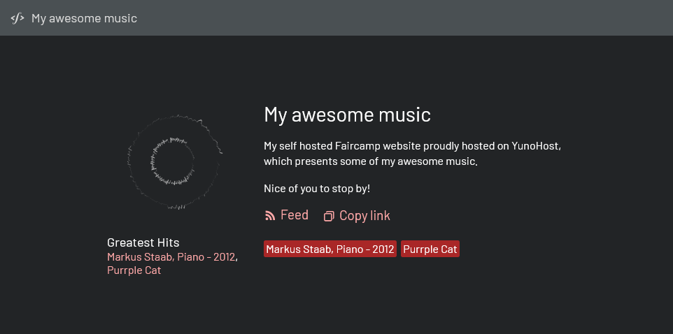

<!--
To README zostało automatycznie wygenerowane przez <https://github.com/YunoHost/apps/tree/master/tools/readme_generator>
Nie powinno być ono edytowane ręcznie.
-->

# Faircamp dla YunoHost

[](https://ci-apps.yunohost.org/ci/apps/faircamp/)


[](https://install-app.yunohost.org/?app=faircamp)

*[Przeczytaj plik README w innym języku.](./ALL_README.md)*

> *Ta aplikacja pozwala na szybką i prostą instalację Faircamp na serwerze YunoHost.*  
> *Jeżeli nie masz YunoHost zapoznaj się z [poradnikiem](https://yunohost.org/install) instalacji.*

## Przegląd

Faircamp is a [Static Site Generator](https://en.wikipedia.org/wiki/Static_site_generator) dedicated to music producers.

With this package, Faircamp will automatically regenerate ([using Systemd Path Units](https://www.putorius.net/systemd-path-units.html)) your website if any change is made to your sources.

Alternatively to this package, you can [install Faircamp on your computer](https://simonrepp.com/faircamp/manual/installation.html) and use its rsync feature (ith the `--deploy` or `--deploy-destination` options) to send the builded website to a [My Webapp](https://apps.yunohost.org/app/my_webapp) folder on your YunoHost server.


**Dostarczona wersja:** 1.0.0~ynh2

## Zrzuty ekranu



## Dokumentacja i zasoby

- Oficjalna strona aplikacji: <https://simonrepp.com/faircamp/>
- Oficjalna dokumentacja dla administratora: <https://simonrepp.com/faircamp/manual/>
- Repozytorium z kodem źródłowym: <https://codeberg.org/simonrepp/faircamp>
- Sklep YunoHost: <https://apps.yunohost.org/app/faircamp>
- Zgłaszanie błędów: <https://github.com/YunoHost-Apps/faircamp_ynh/issues>

## Informacje od twórców

Wyślij swój pull request do [gałęzi `testing`](https://github.com/YunoHost-Apps/faircamp_ynh/tree/testing).

Aby wypróbować gałąź `testing` postępuj zgodnie z instrukcjami:

```bash
sudo yunohost app install https://github.com/YunoHost-Apps/faircamp_ynh/tree/testing --debug
lub
sudo yunohost app upgrade faircamp -u https://github.com/YunoHost-Apps/faircamp_ynh/tree/testing --debug
```

**Więcej informacji o tworzeniu paczek aplikacji:** <https://yunohost.org/packaging_apps>
